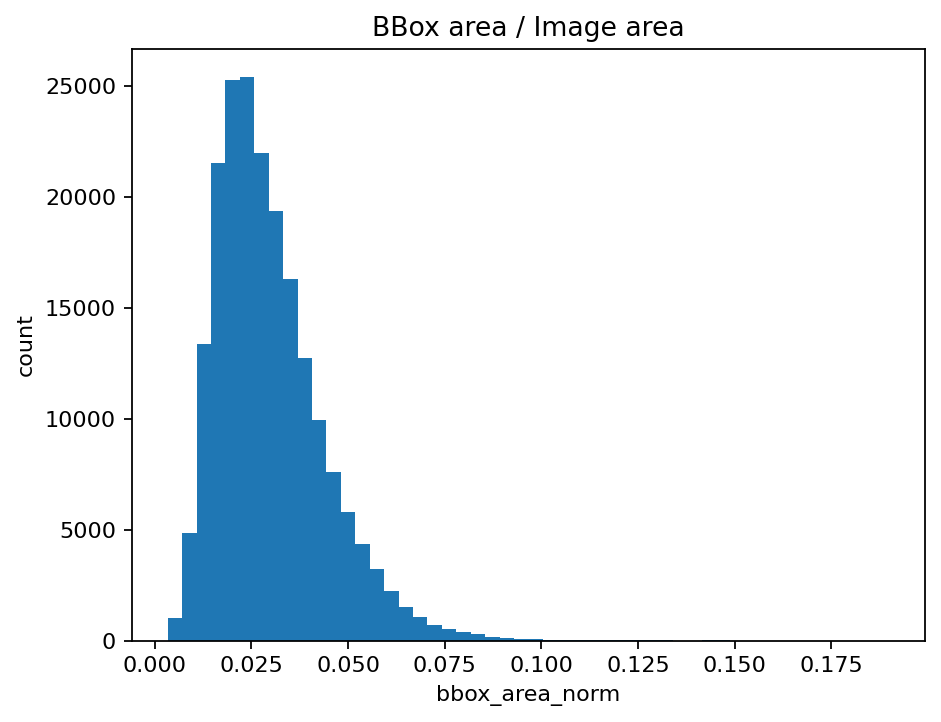
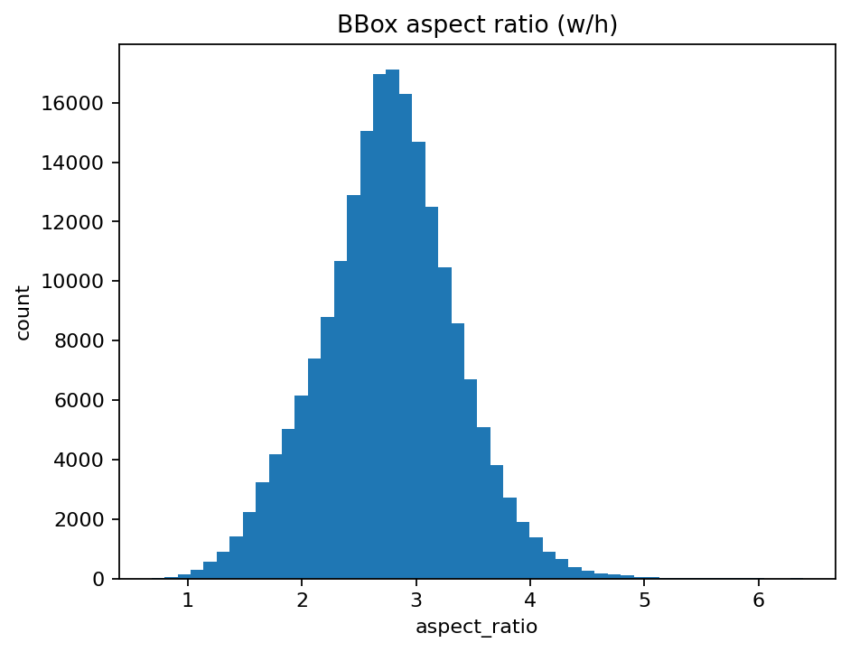
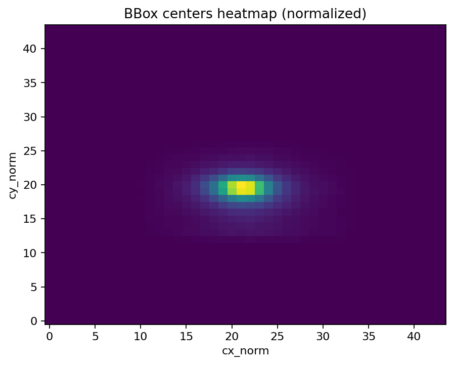
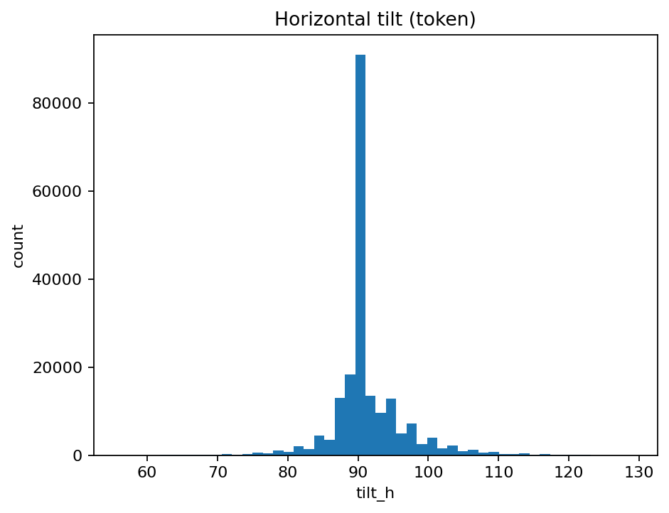
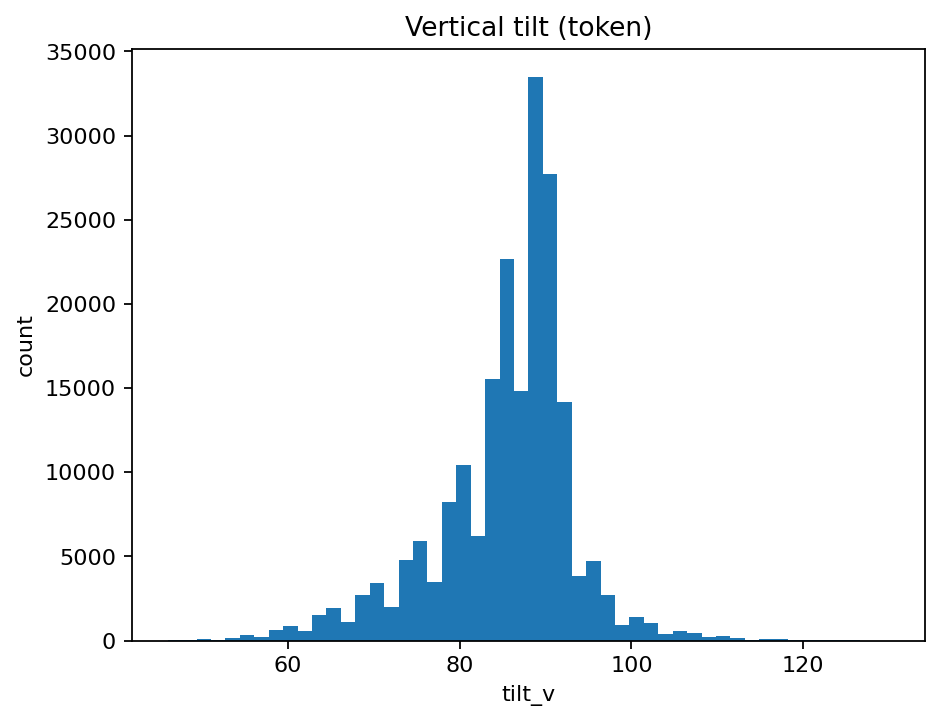
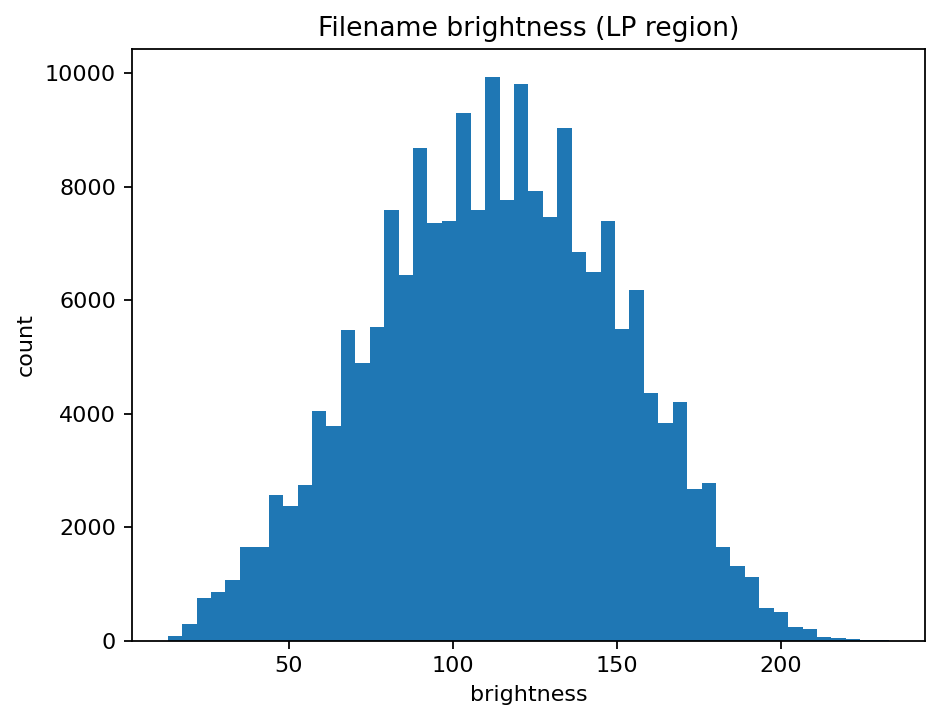
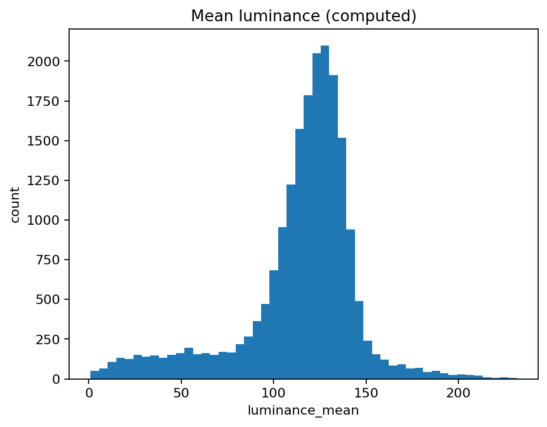
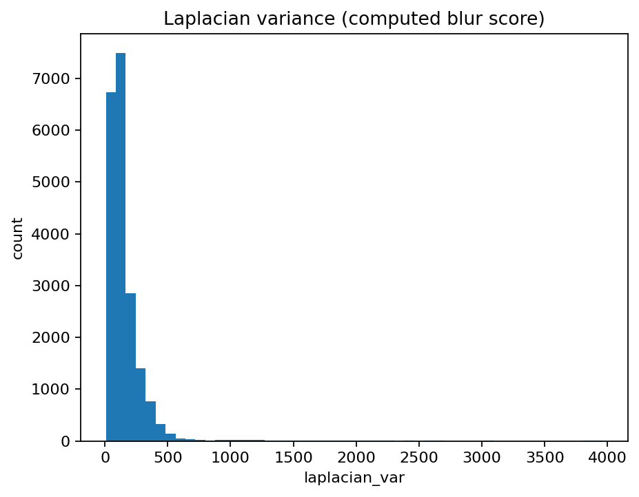

# EDA поднабора CCPD Base для задачи детекции и локализации номерных знаков

## 1. Что именно я анализировал
В этом разделе я провёл разведочный анализ поднабора **CCPD Base** (subset: `ccpd_base`) для задачи **детекции и локализации автомобильных номерных знаков**.

Я обработал **199 996** изображений. На этапе EDA я не использовал разбиение на train/val/test и работал в режиме **split = all**, потому что моя цель здесь - понять распределения признаков, выявить типичные и сложные случаи и сформулировать требования к baseline и последующему нейросетевому детектору.

Аннотации я извлекал из **имён файлов CCPD**, что позволяет восстановить:
- координаты прямоугольника номерного знака (bbox),
- токены наклона (tilt_h, tilt_v),
- токены яркости и размытости в области номера (brightness, blurriness).

Кроме того, для подвыборки **20 000** изображений я вычислил пиксельные метрики:
- `luminance_mean` - средняя яркость кадра в оттенках серого,
- `laplacian_var` - дисперсия Лапласиана как приближённая оценка резкости (чем меньше значение, тем сильнее выражено размытие).

---

## 2. Геометрия объекта: размер, форма, взаимосвязи

### 2.1 Масштаб номера в кадре (bbox_area_norm)
Я измерил долю площади bbox относительно площади изображения (`bbox_area_norm`). Получилось:

- среднее: **0.0298** (то есть примерно **2.98%** площади кадра),
- медиана: **0.0272**,
- p05–p95: **0.0123 – 0.0561**,
- min–max: **0.00337 – 0.1899**.

Эти значения означают, что номерной знак в CCPD Base в большинстве случаев является **маленьким объектом**: у основной массы примеров он занимает порядка **1–6%** площади изображения. Для детекции это принципиально: малые объекты сильнее страдают от даунскейла, агрессивных кропов и недостаточного разрешения входа.

**Практический вывод, который я использую дальше:** при построении baseline и последующих моделей нужно учитывать режим *small-object detection* (подбор разрешения, аугментаций масштаба, корректная стратегия мультискейла).

---

### 2.2 Соотношение сторон bbox (aspect_ratio = w/h)
Распределение `aspect_ratio` получилось следующим:

- среднее: **2.756**,
- медиана: **2.764**,
- p05–p95: **1.743 – 3.724**,
- min–max: **0.681 – 6.392**.

Большинство объектов имеют ожидаемую "вытянутую" форму (примерно 2–3.5 по w/h), но присутствуют выбросы: как очень узкие/"почти квадратные" случаи, так и необычно вытянутые прямоугольники. Такие хвосты распределения я трактую как следствие перспективных искажений, сильных наклонов, частичных перекрытий и/или нестандартных сцен.

**Практический вывод:** при оценке качества baseline имеет смысл отдельно смотреть качество на хвостах распределения `aspect_ratio`, так как именно там чаще возникают ошибки локализации.

---

### 2.3 Площадь vs соотношение сторон
Диаграмма `bbox_area_norm` vs `aspect_ratio` показывает плотное “ядро”:
- по площади: чаще всего **0.02–0.05**,
- по форме: чаще всего **2–3.5**,
и при этом заметные разреженные хвосты по обеим осям.

Для меня это важно как подтверждение того, что датасет в основном состоит из типовых примеров, но содержит редкие сложные случаи, на которых классические методы обычно "ломаются".

---

## 3. Положение номера в кадре и возможный bias
Я построил теплокарту центров bbox в нормализованных координатах (`cx_norm`, `cy_norm`). На ней видно выраженное смещение к центральной области кадра: номерной знак чаще оказывается близко к центру.

Это хороший индикатор потенциального bias: модель (особенно мощная) может неявно использовать “геометрию сцены” и ожидать номер рядом с центром. В реальных данных такое предположение часто не выполняется (камера может быть сбоку, номер может быть в углу, часть авто может выходить за кадр).

**Практический вывод:** на этапе обучения я буду считать важным использовать аугментации, которые “ломают” центральный приор (смещения, кропы, перспективные преобразования), чтобы повысить переносимость на реальные сцены.

---

## 4. Наклоны и перспектива (tilt tokens)

### 4.1 Горизонтальный наклон (tilt_h)
- среднее: **91.29**, медиана: **90**,
- p05–p95: **85 – 101**,
- min–max: **56 – 129**.

Гистограмма имеет ярко выраженный пик около 90: значит, в основной массе примеров горизонтальные отклонения умеренные.

---

### 4.2 Вертикальный наклон (tilt_v)
- среднее: **85.35**, медиана: **87**,
- p05–p95: **69 – 96**,
- min–max: **46 – 130**.

По вертикальному наклону разброс существенно шире. Это отражает более сильные перспективные искажения по вертикали (например, съёмка сверху/снизу, наклон камеры относительно автомобиля).

**Практический вывод:** устойчивость к перспективе - обязательное требование; при построении baseline я ожидаю заметное ухудшение качества на примерах с выраженными вертикальными наклонами.

---

## 5. Освещённость

### 5.1 Brightness token (по области номера)
- среднее: **112.96**,
- медиана: **113**,
- p05–p95: **50 – 173**,
- min–max: **13 – 233**.

Распределение широкое; нижний хвост указывает на наличие очень тёмных случаев.

---

### 5.2 Средняя яркость кадра (computed luminance_mean, 20k)
- среднее: **114.44**,
- медиана: **121.13**,
- p05–p95: **40.69 – 149.92**,
- min–max: **0.93 – 231.58**.

Пиксельная оценка подтверждает, что в данных присутствуют крайне тёмные изображения (почти “ночные”), а также очень яркие сцены. Для детекции это означает повышенные риски ошибок из-за низкого контраста, засветов и шумов в тенях.

**Практический вывод:** при дальнейшем моделировании я буду считать фотометрические вариации (brightness/contrast/gamma и т.п.) не "дополнительной опцией", а необходимой частью пайплайна.

---

## 6. Размытость и резкость

### 6.1 Blurriness token (по области номера)
- среднее: **49.59**,
- медиана: **37**,
- p05–p95: **11 – 131**,
- min–max: **2 – 1326**.

Распределение имеет тяжёлый правый хвост: встречаются случаи с крайне высокой размытостью. Это ожидаемо для сцен с движением и/или вибрацией камеры.

---

### 6.2 Laplacian variance (computed laplacian_var, 20k)
- среднее: **154.29**,
- медиана: **114.70**,
- p05–p95: **34.82 – 374.11**,
- min–max: **7.61 – 3964.44**.

Дисперсия Лапласиана показывает широкий диапазон резкости: есть и сильно размытые кадры (низкие значения), и очень “резкие/шумные” (высокие значения). Это полезно для построения “сложностных” подмножеств и отдельной оценки устойчивости алгоритма.

**Практический вывод:** при построении baseline я ожидаю, что ошибки будут концентрироваться на нижнем хвосте `laplacian_var` и на верхнем хвосте токена `blurriness`.

---

## 7. Проверка корректности bbox (краевые случаи)
Я оценил долю примеров, где bbox касается границы изображения (`touches_border_rate`). Получилось:

- `touches_border_rate` **0.000075**.

То есть почти во всех случаях bbox полностью находится внутри кадра. Я интерпретирую это как признак “чистоты” поднабора CCPD Base: номера редко обрезаны краем кадра. С практической точки зрения это облегчает задачу по сравнению с реальными потоковыми данными, где частично видимые номера встречаются заметно чаще.

---

## 8. Выводы, которые я использую при построении baseline
На основании EDA я фиксирую для себя следующие факты и последствия:

1. **Номер - малый объект.** В среднем он занимает около **3%** кадра, и в 90% случаев - **примерно 1.2–5.6%**. Это требует аккуратного обращения с масштабом и разрешением.  
2. **В данных есть центральный приор.** Центры bbox концентрируются в середине кадра, что может давать смещение и снижать переносимость на реальные сцены без правильных аугментаций.  
3. **Вертикальная перспектива выражена сильнее горизонтальной.** Это означает, что устойчивость к перспективе - ключевой фактор качества.  
4. **Освещённость сильно варьируется.** Присутствуют очень тёмные кадры и яркие сцены, что делает важными фотометрические вариации.  
5. **Размытость имеет тяжёлый хвост.** В данных есть крайне размытые случаи; именно они должны стать частью отдельной проверки устойчивости baseline.

Следующий шаг моей работы - построить **Classical CV baseline (OpenCV)** и измерить его качество по метрикам локализации (IoU/precision/recall) с анализом ошибок в “сложных” зонах распределений (малые bbox, низкая яркость, сильный blur, выраженный tilt).
