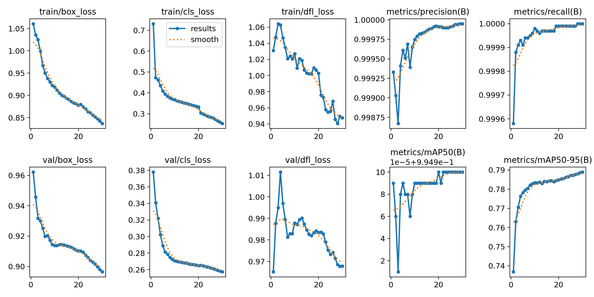
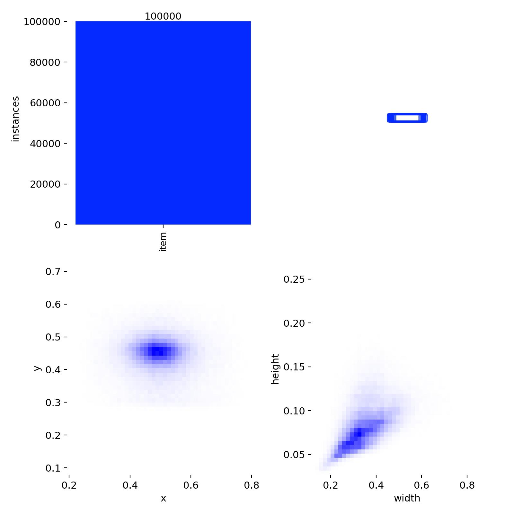
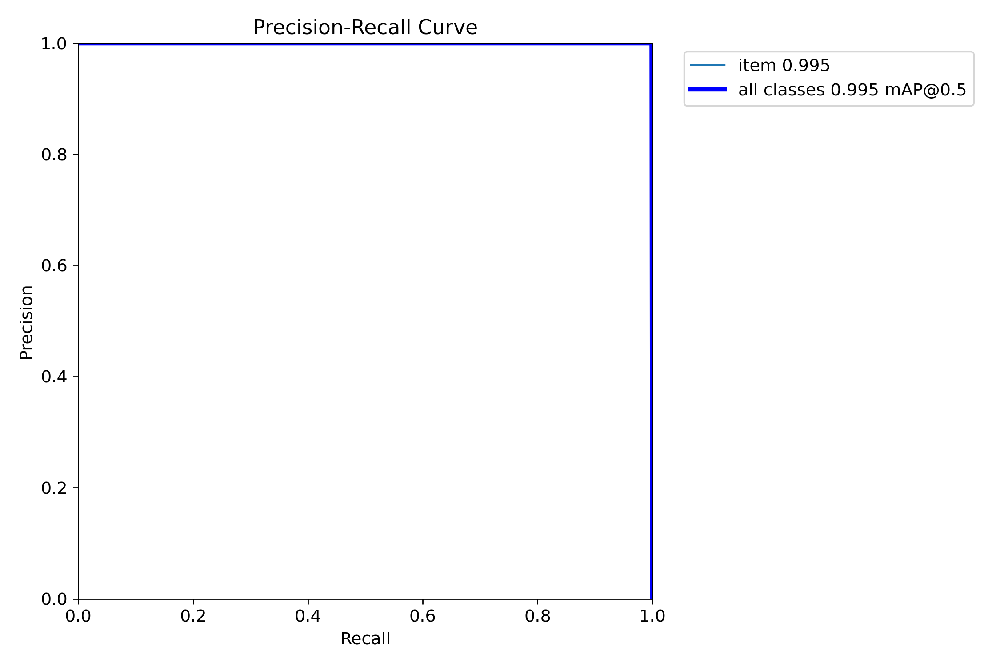
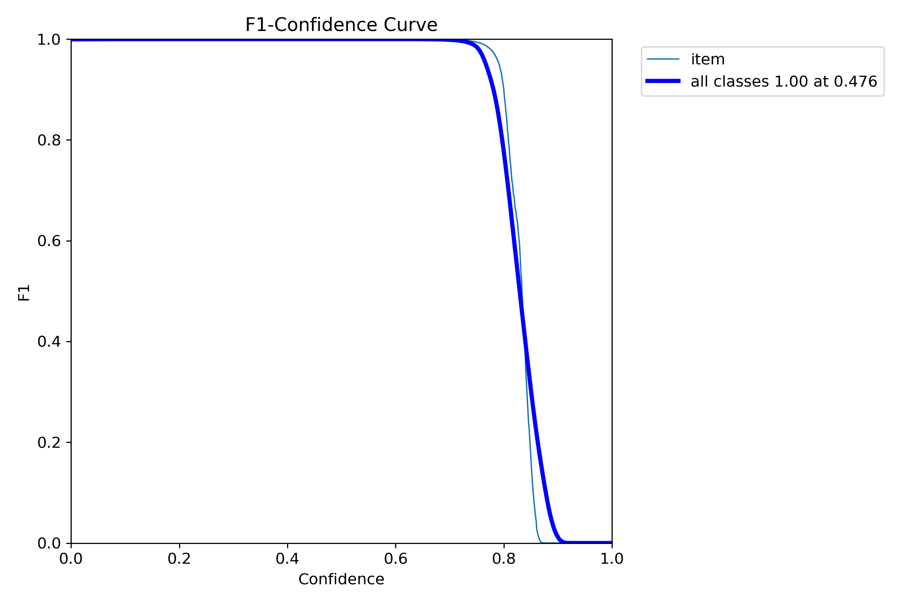
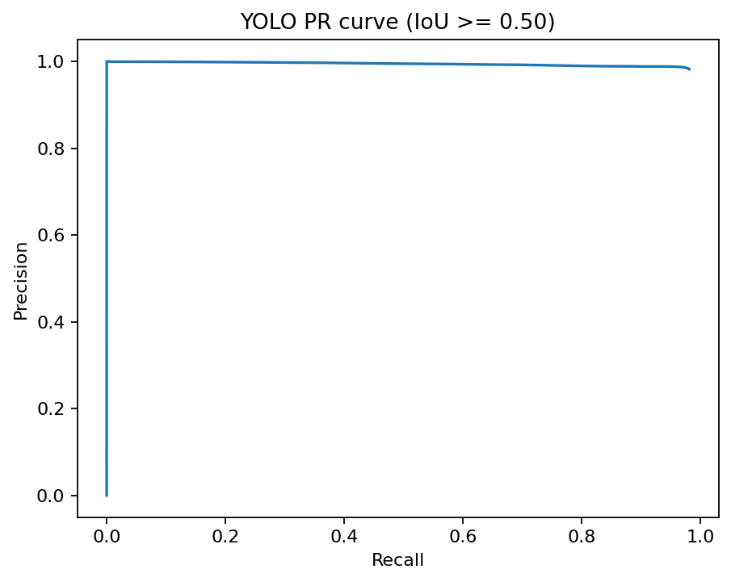
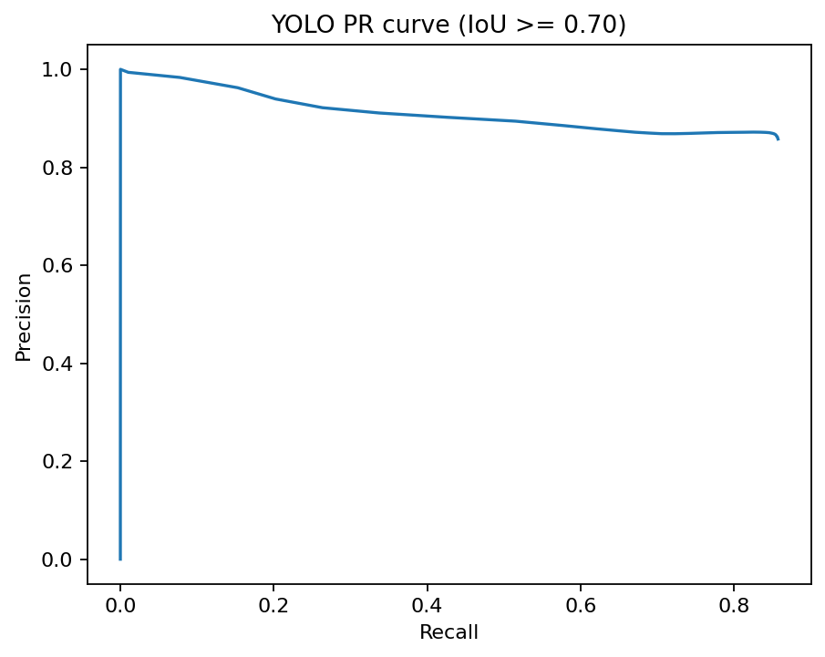
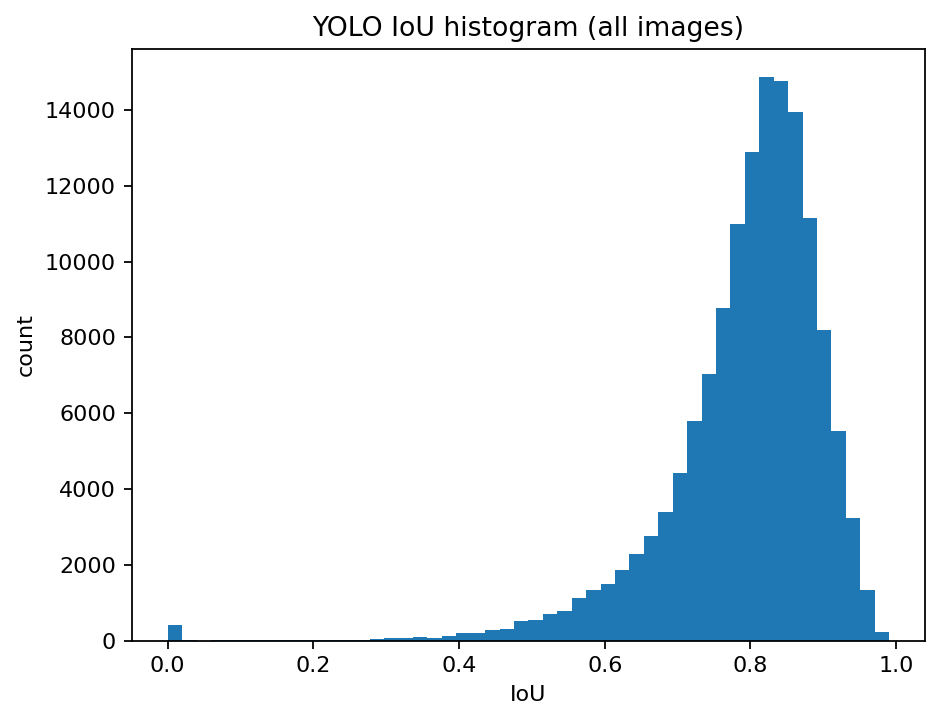

# YOLO baseline: экспорт датасета, обучение, оценка и интерпретация

В этом отчёте фиксируется первый нейросетевой baseline для задачи детекции и локализации номерных знаков на данных CCPD. Цель этого этапа - перейти от classical CV baseline к обучаемому детектору, измерить качество на валидации и тесте, а затем сопоставить результаты с уже построенным classical baseline.

---

## 1. Что именно было сделано

На данном этапе реализован и полностью прогнан следующий пайплайн:

1. Экспорт CCPD в формат YOLO Detection.
2. Формирование разбиений `train / val / test` на основе `splits/*.txt`.
3. Обучение детектора **YOLO11n** на экспортированном датасете.
4. Внутренняя оценка Ultralytics на validation/test.
5. Кастомная оценка на тех же локализационных метриках, что и для classical CV baseline:
   - mean IoU;
   - median IoU;
   - success rate при `IoU >= 0.50`;
   - success rate при `IoU >= 0.70`;
   - AP / PR-кривые.
6. Сравнение с ранее зафиксированным classical CV baseline.

Таким образом, текущий этап закрывает основной пробел между классическим baseline и нейросетевой частью ВКР.

---

## 2. Как запускался пайплайн

Команда запуска из корня проекта:

```cmd
python scripts/run_yolo_pipeline.py --config config.yaml
```

Пайплайн последовательно выполнял:

- экспорт YOLO-датасета в `outputs/yolo_dataset`;
- обучение модели;
- встроенную валидацию Ultralytics;
- кастомную оценку в `outputs/yolo_eval`.

---

## 3. Экспорт данных в YOLO-формат

Экспорт выполнен успешно. Разбиения были прочитаны не из физических подпапок `train/val/test` внутри `ccpd_base`, а из `data/CCPD2019/CCPD2019/splits`, после чего пути до изображений были корректно определены и размечены в формате YOLO.

Итоговый размер экспортированных подмножеств:

- **train:** 100 000 изображений;
- **val:** 99 996 изображений;
- **test:** 141 982 изображений.

Материализация изображений выполнялась через **hardlink**, что позволило ускорить формирование датасета и не дублировать изображения физически.

---

## 4. Конфигурация обучения YOLO

В качестве первого нейросетевого baseline выбран **YOLO11n** — компактная одноэтапная модель, подходящая для быстрой постановки воспроизводимого baseline-эксперимента.

### Основные параметры обучения

- модель: `yolo11n.pt`
- размер входа: **960 × 960**
- batch size: **16**
- число эпох: **30**
- устройство: **CUDA, NVIDIA GeForce RTX 3060 12GB**
- оптимизатор: `auto` → выбран `MuSGD`
- `single_cls=True`
- аугментации:
  - `hsv_h=0.015`
  - `hsv_s=0.7`
  - `hsv_v=0.4`
  - `degrees=5.0`
  - `translate=0.08`
  - `scale=0.35`
  - `shear=2.0`
  - `perspective=0.0005`
  - `fliplr=0.5`
  - `mosaic=1.0`

### Время обучения

Полный цикл из 30 эпох занял:

- **17.4 часа**.

Лучшие веса были сохранены в:

- [`runs/detect/outputs/yolo_train/ccpd_base_yolo11n_960/weights/best.pt`](runs/detect/outputs/yolo_train/ccpd_base_yolo11n_960/weights/best.pt)

Последние веса:

- [`runs/detect/outputs/yolo_train/ccpd_base_yolo11n_960/weights/last.pt`](runs/detect/outputs/yolo_train/ccpd_base_yolo11n_960/weights/last.pt)

---

## 5. Результаты на validation split

По встроенной валидации Ultralytics на validation split после 30 эпох получены следующие метрики:

- **Precision = 0.995**
- **Recall = 1.000**
- **mAP50 = 0.995**
- **mAP50-95 = 0.789**

Интерпретация:

- модель практически не теряет объекты на validation split;
- на стандартной validation-выборке локализация очень устойчива;
- рост `mAP50-95` по эпохам постепенно насыщается, но продолжает улучшаться вплоть до конца обучения.

## Иллюстративные материалы по обучению YOLO11n

Для визуального подтверждения корректности обучения нейросетевого детектора и анализа свойств обучающей выборки использованы стандартные артефакты, автоматически сформированные библиотекой Ultralytics в процессе обучения модели YOLO11n.

### Результаты обучения



Данная иллюстрация отражает изменение функций потерь и контрольных метрик на протяжении всего процесса обучения. По характеру графиков можно заключить, что обучение модели происходило устойчиво: значения потерь уменьшались, а итоговые метрики качества постепенно улучшались и к концу обучения стабилизировались. Это указывает на достижение сходимости и на корректную настройку процесса обучения для задачи локализации номерных знаков.

### Статистика разметки



Иллюстрация демонстрирует распределение центров и размеров ограничивающих рамок, соответствующих номерным знакам. Анализ данного рисунка показывает, что целевые объекты, как правило, занимают небольшую часть изображения и обладают достаточно устойчивыми геометрическими характеристиками. Кроме того, наблюдается концентрация объектов в центральной части кадра, что согласуется с особенностями набора данных CCPD.

### Precision–Recall кривая



Данная кривая характеризует изменение точности и полноты в зависимости от порога уверенности модели. Положение кривой вблизи верхней правой области графика свидетельствует о том, что модель одновременно обеспечивает высокую полноту обнаружения и высокую точность локализации. Это является важным индикатором высокого качества обученного детектора.

### F1-кривая



F1-кривая позволяет определить диапазон порогов уверенности, при которых достигается наилучший баланс между точностью и полнотой. Максимум данной кривой соответствует оптимальному режиму работы детектора. Это позволяет сделать вывод о практической пригодности модели для дальнейшего применения в задаче детекции номерных знаков.

---

## 6. Результаты на test split

### 6.1. Встроенные метрики Ultralytics

На test split встроенная оценка Ultralytics дала:

- **Precision = 0.9807**
- **Recall = 0.9779**
- **mAP50 = 0.9844**
- **mAP75 = 0.7069**
- **mAP50-95 = 0.6114**

Это ниже, чем на validation split, что ожидаемо для более тяжёлого тестового набора. При этом качество остаётся высоким по полноте и precision, а падение сильнее заметно именно на строгой локализации `mAP50-95`, то есть на более жёстких критериях точности бокса.

### 6.2. Кастомная оценка локализации

Кастомная оценка на test split (`141 982` изображений) дала следующие результаты:

- число изображений: **141 982**
- `pred_rate = 0.99957`
- `n_no_predictions = 61`
- `mean_score_pred_only = 0.7777`
- **mean IoU = 0.7940**
- **median IoU = 0.8153**
- **strict success rate (IoU >= 0.70) = 85.73%**

### 6.3. Метрики при `IoU >= 0.50`

- **AP = 0.9757**
- **best F1 = 0.9818**
- **best precision = 0.9825**
- **best recall = 0.9810**
- **best score threshold = 0.01**
- **success rate (IoU >= 0.50) = 98.15%**


### 6.4. Метрики при `IoU >= 0.70`

- **AP = 0.7781**
- **best F1 = 0.8603**
- **best precision = 0.8668**
- **best recall = 0.8539**
- **best score threshold = 0.55**
- **success rate (IoU >= 0.70) = 85.73%**






---

## 7. Сравнение с classical CV baseline

Ранее для classical CV baseline были зафиксированы следующие результаты на CCPD Base:

- **mean IoU = 0.1953**
- **success rate (IoU >= 0.50) = 24.09%**
- **success rate (IoU >= 0.70) = 18.23%**
- **AP = 0.0753** при `IoU >= 0.50`
- **AP = 0.0479** при `IoU >= 0.70`

Для YOLO baseline на test split получено:

- **mean IoU = 0.7940**
- **success rate (IoU >= 0.50) = 98.15%**
- **success rate (IoU >= 0.70) = 85.73%**
- **AP = 0.9757** при `IoU >= 0.50`
- **AP = 0.7781** при `IoU >= 0.70`

### Абсолютный выигрыш YOLO по сравнению с CV baseline

Согласно автоматическому сравнению `compare_vs_cv.json`, прирост составил:

- **+0.5987** к mean IoU;
- **+74.06 п.п.** к success rate при `IoU >= 0.50`;
- **+67.50 п.п.** к success rate при `IoU >= 0.70`;
- **+0.9004** к AP при `IoU >= 0.50`;
- **+0.7302** к AP при `IoU >= 0.70`.

### Интерпретация сравнения

Полученный результат означает, что переход от эвристического детектора к обучаемому YOLO-детектору радикально улучшил качество локализации номерного знака. Если classical baseline служил только нижней границей качества и аргументом в пользу DL-подхода, то YOLO baseline уже демонстрирует качество, достаточное для практического применения и дальнейшего развития системы.

---

## 8. Анализ по срезам test split

Дополнительно проведён анализ по различным типам сцен.

### Общий срез (`all`)

- **mean IoU = 0.7940**
- **median IoU = 0.8153**
- **success@0.50 = 98.15%**
- **success@0.70 = 85.73%**

### Малые номера (`small_area_q25`)

- **mean IoU = 0.8292**
- **success@0.50 = 99.24%**
- **success@0.70 = 94.91%**

### Крупные номера (`large_area_q75`)

- **mean IoU = 0.7520**
- **success@0.50 = 95.12%**
- **success@0.70 = 74.60%**

### Тёмные сцены (`dark_q25`)

- **mean IoU = 0.7484**
- **success@0.50 = 94.53%**
- **success@0.70 = 70.54%**

### Яркие сцены (`bright_q75`)

- **mean IoU = 0.8067**
- **success@0.50 = 99.18%**
- **success@0.70 = 89.99%**

### Сильный blur (`blur_q75`)

- **mean IoU = 0.8105**
- **success@0.50 = 99.39%**
- **success@0.70 = 92.28%**

### Большой горизонтальный наклон (`tilt_h_q75`)

- **mean IoU = 0.7979**
- **success@0.50 = 98.95%**
- **success@0.70 = 89.90%**

### Большой вертикальный наклон (`tilt_v_q75`)

- **mean IoU = 0.7667**
- **success@0.50 = 97.81%**
- **success@0.70 = 80.42%**

### Вывод по срезам

Наиболее трудными режимами для YOLO baseline оказались:

1. **тёмные сцены**;
2. **крупные номера**;
3. **сильный вертикальный наклон**.

При этом даже на этих режимах качество остаётся существенно выше classical CV baseline. Интересно, что модель особенно уверенно работает на срезе `small_area_q25`, то есть именно с относительно малыми номерами, что критически важно для реальных дорожных сцен.

---

## 9. Почему test заметно сложнее validation

По результатам видно выраженное расхождение:

- на **validation**: `mAP50-95 = 0.789`;
- на **test**: `mAP50-95 = 0.611`.

Я интерпретирую это следующим образом:

1. validation split ближе к стандартному распределению `ccpd_base`;
2. test split, судя по логам резолвинга путей, включает более сложные подмножества, например `ccpd_blur`;
3. метрика `mAP50-95` чувствительна к даже небольшим смещениям границ бокса, поэтому на сложных сценах она падает сильнее, чем `mAP50`.

Это важное наблюдение для ВКР: высокая `mAP50` сама по себе не означает идеальную локализацию, поэтому использование кастомных метрик IoU/success rate является оправданным и полезным дополнением к стандартным YOLO-метрикам.

---

## 10. Ключевой вывод для ВКР

Первый нейросетевой baseline успешно реализован и даёт сильный прирост качества относительно classical CV baseline.

### Главное по итогам этапа

- экспорт CCPD → YOLO выполнен корректно;
- модель YOLO11n обучена на полном train split;
- validation-качество очень высокое (`mAP50-95 = 0.789`);
- на сложном test split модель сохраняет высокое качество локализации:
  - `mean IoU = 0.7940`;
  - `success@0.50 = 98.15%`;
  - `success@0.70 = 85.73%`;
- YOLO baseline многократно превосходит classical CV baseline по всем ключевым метрикам.

### Практическое значение

Этот результат подтверждает, что для задачи локализации номерных знаков в условиях реальных дорожных сцен использование нейросетевого детектора является не просто «улучшением», а качественно более сильным решением по сравнению с контурными и морфологическими эвристиками.

---

## 11. Следующий логичный шаг

Следующий этап после фиксации этого baseline может быть одним из двух:

1. **усиление YOLO baseline**:
   - подбор размера входа;
   - подбор более сильной модели (`yolo11s`, `yolo11m`);
   - контроль аугментаций;
   - анализ ошибок на hardest slices;

2. **расширение исследования**:
   - сравнение с ещё одним детектором;
   - последующая интеграция распознавания текста номера после детекции.
